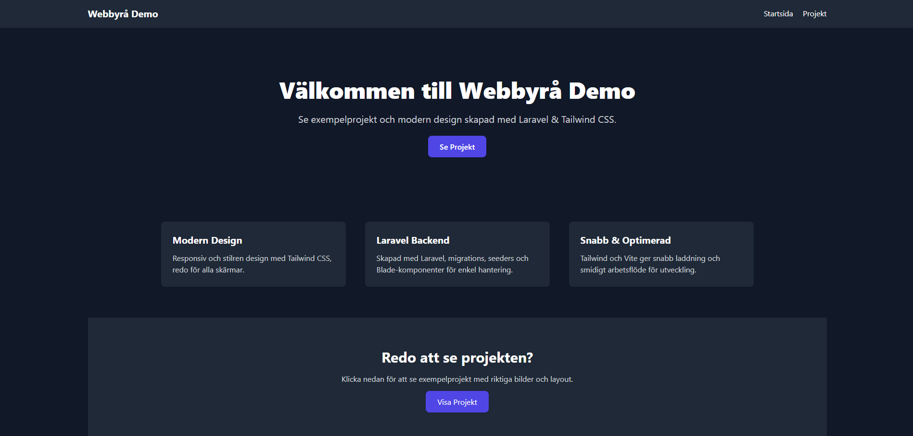

# Laravel Demo Sida



Detta är en demo-webbsida byggd med **Laravel** och **Tailwind CSS** som visar både frontend- och backend-färdigheter. Sidan är responsiv, har en clean design och innehåller exempelprojekt med bilder.  
**Backend:** MySQL med phpMyAdmin, migrations och seeders.

---

> ## 🚀 Funktioner
>
> - **Laravel backend**
>     - Blade templates
>     - MySQL-databas med phpMyAdmin
>     - Migrations & seeders
>     - Project-modell med bilder
> - **Tailwind CSS frontend**
>     - Hero-sektion med call-to-action
>     - Grid med kort för projekt
>     - Responsiv design
> - **Footer** alltid längst ner
> - **Exempelprojekt** via seeders

---

> ## ⚙️ Installation
>
> 1. Klona repot:
>
> ```bash
> git clone https://github.com/ditt-användarnamn/laravel-demo-sida.git
> cd laravel-demo-sida
> ```
>
> 2. Installera beroenden:
>
> ```bash
> composer install
> npm install
> ```
>
> 3. Kopiera `.env.example` till `.env` och uppdatera databaskonfiguration (MySQL):
>
> ```bash
> cp .env.example .env
> ```
>
> 4. Generera app-nyckel:
>
> ```bash
> php artisan key:generate
> ```
>
> 5. Skapa och fyll databasen:
>
> ```bash
> php artisan migrate --seed
> ```
>
> 6. Starta utvecklingsservern:
>
> ```bash
> php artisan serve
> npm run dev
> ```
>
> Öppna sedan `http://127.0.0.1:8000` i webbläsaren.  
> phpMyAdmin kan användas för att se databasen och projekten.

---

> ## 🗂 Struktur
>
> - `/resources/views` – Blade templates
> - `/public/images` – Projektbilder
> - `/database/seeders` – Seeders för exempelprojekt
> - `/app/Models` – Laravel-modeller
